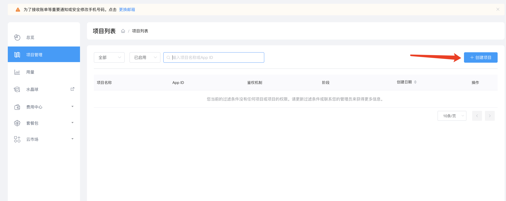
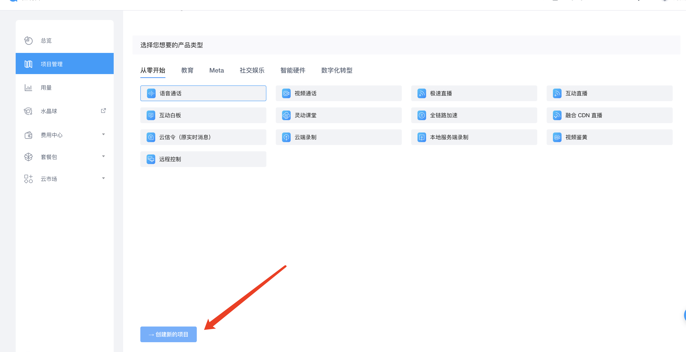
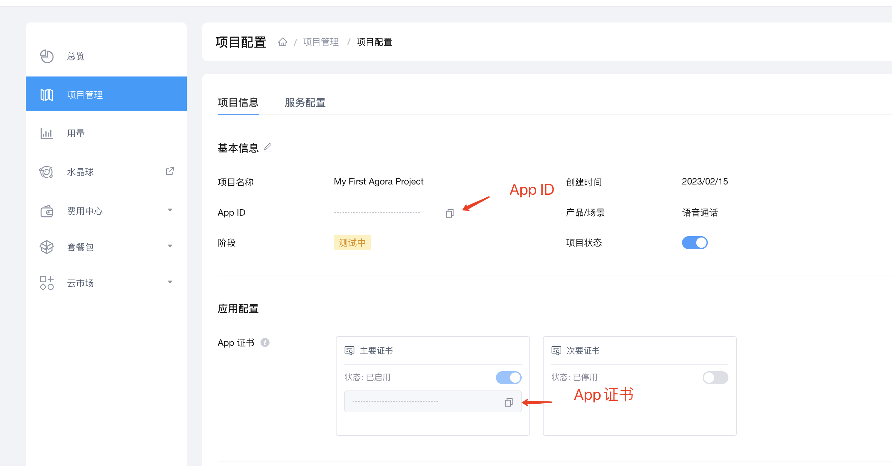
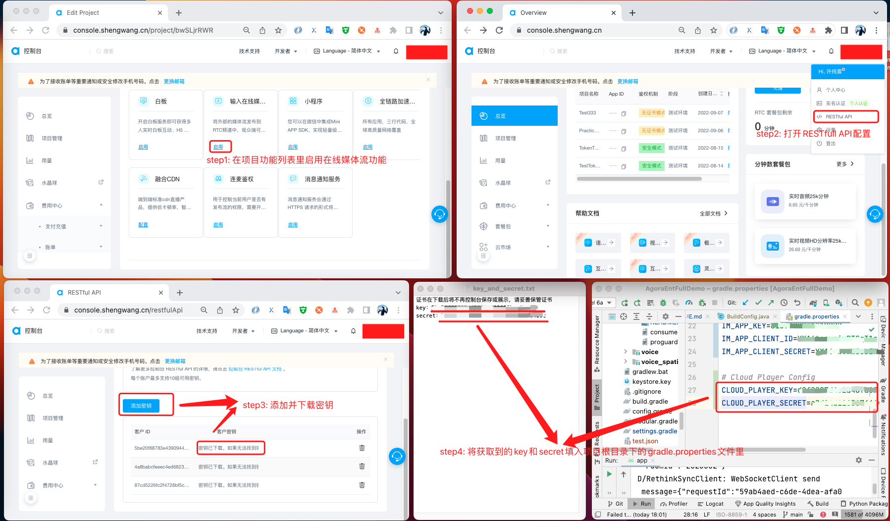
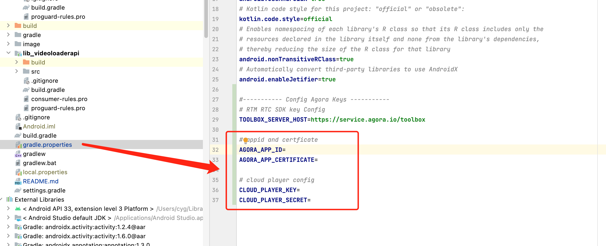

# VideoLoaderAPI

VideoLoaderAPI 即秒开秒切场景化api, 该模块旨在帮助视频直播开发者更快集成声网秒切、秒开相关能力的最佳实践.

### 一、快速开始

这个部分主要介绍如何快速跑通 VideoLoaderAPI Demo

#### 1.环境准备

- 最低兼容 Android 5.0（SDK API Level 21）
- Android Studio 3.5及以上版本。
- Android 5.0 及以上的手机设备。

#### 2.运行示例

- <mark>1. </mark> 获取声网App ID -------- [声网Agora - 文档中心 - 如何获取 App ID](https://docs.agora.io/cn/Agora%20Platform/get_appid_token?platform=All%20Platforms#%E8%8E%B7%E5%8F%96-app-id)

  > - 点击创建应用
  >
  >   
  >
  > - 选择你要创建的应用类型
  >
  >   
  >
  > - 得到App ID与App 证书
  >
  >   
  >
  > - 秒切机器人服务配置（CloudPlayer）
  >
  >   

  获取App 证书 ----- [声网Agora - 文档中心 - 获取 App 证书](https://docs.agora.io/cn/Agora%20Platform/get_appid_token?platform=All%20Platforms#%E8%8E%B7%E5%8F%96-app-%E8%AF%81%E4%B9%A6)
- <mark>2. </mark> 在项目的[**gradle.properties**](../../gradle.properties)里填写需要的声网 App ID 和 App证书、Cloudplayer 配置  
  

  ```texag-0-1gpap96h0ag-1-1gpap96h0ag-0-1gpap96h0ag-1-1gpap96h0ag-0-1gpap96h0ag-1-1gpap96h0ag-0-1gpap96h0ag-1-1gpap96h0ag-0-1gpap96h0ag-1-1gpap96h0
  AGORA_APP_ID：声网appid  
  AGORA_APP_CERTIFICATE：声网Certificate 
  CLOUD_PLAYER_KEY：声网RESTful API key
  CLOUD_PLAYER_SECRET：声网RESTful API secret
  ```

- <mark>3. </mark> 用 Android Studio 运行项目即可开始您的体验

#### 3.项目介绍

- <mark>1. 概述</mark>
> VideoLoaderAPI 即秒开秒切场景化api, 该模块旨在帮助视频直播开发者更快集成声网秒切、秒开相关能力的最佳实践.
>
- <mark>2. 功能介绍</mark>
> VideoLoaderAPI Demo 目前已涵盖以下功能
> - 选择预加载模式和视频出图模式
>
>   相关代码请参考：[MainActivity](app/src/main/java/io/agora/videoloaderapi/ui/MainActivity.kt) 
>
> - 秒开
>
>   相关代码请参考：[LiveDetailActivity](app/src/main/java/io/agora/videoloaderapi/ui/RoomListActivity.kt) 
>   
>- 秒切
> 
>  相关代码请参考：[LiveDetailActivity](app/src/main/java/io/agora/videoloaderapi/ui/LiveDetailActivity.kt) 中的 OnPageChangeCallback 的实现。


### 二、VideoLoaderAPI 使用教程

#### 2.0 文件简介

相关代码请参考：[VideoLoaderAPI](lib_videoloaderapi/src/main/java/io/agora/videoloaderapi/OnLiveRoomItemTouchEventHandler.kt) 

* OnLiveRoomItemTouchEventHandler: 秒开事件处理模块
* OnRoomListScrollEventHandler: 房间列表滑动事件处理模块
* OnPageScrollEventHandler: 直播间切换事件处理模块
* VideoLoader: 内部使用用于处理频道管理的类

#### 2.1 秒开

##### 2.1.1 定义

观众从点击房间列表内某个直播间, 到进入直播间内看到直播画面的过程定义为 “秒开”

##### 2.1.2 秒开的最佳实践

1. 房间列表页面对视野范围内的频道进行 preloadChannel（channelList, token）

   (可link到 preloadChannel api 文档)

   1. 如果房间总数小于20, 可以对所有房间进行 preloadChannel
   2. 如果大于20, 对前20个房间进行 preloadChannel, 在滑动房间列表时, 当滑动结束, 对视野范围内的房间进行 preloadChannel

2. 点击直播间 item 处理逻辑：

   1. 手指触碰到直播间 Item： 加入频道并订阅音视频流。（音频静音处理）
   2. 手指触碰后抬起：列表页面切换到直播间内，增加切换动画, 解除音频静音
   3. 手指触碰后滑走：未完成有效点击，退出频道

3. 房间列表页面内直播间 item 被点击时，直播间内页面因为懒加载可能未被创建，但此时 RTC 已加入频道并且拉流，导致无渲染视频的 View setup 给 SDK，导致可能错过首个 I 帧解码，导致可能首帧渲染慢, 解决方案如下:

   1. 通过先创建一个视图 View1 设置给 SDK( joinChannelEx 后立刻 setupRemoteVideoEx)，等直播间内页面创建完优先将 View1 添加到视频准备显示的区域容器上，确保第一时间渲染。 其次再处理其他业务逻辑（例如 房间内的 IM 等其他 UI 渲染)
   2. 可以监听 SDK 首帧出图回调, 在回调触发前播放加载动画, 在回调触发后将直播画面设置为 visiable

4. 使用万能 token。

   1. 万能 token 可以节省加入频道前拉取频道 token 的耗时
   2. 出于对业务安全性的考虑, 万能 token 有炸房风险, 需要根据具体需求决定是否使用

##### 2.1.3 如何使用VideoLoaderAPI 快速实现秒开

* **将 OnRoomListScrollEventHandler 绑定在房间列表滚动事件**

  ~~~
  private var onRoomListScrollEventHandler: OnRoomListScrollEventHandler? = null
  private fun initView() {
     onRoomListScrollEventHandler = object: OnRoomListScrollEventHandler(mRtcEngine, UserManager.getInstance().user.id.toInt()) {}
     // mBinding.rvRooms 是房间列表的 RecyclerView
     mBinding.rvRooms.addOnScrollListener(onRoomListScrollEventHandler as OnRoomListScrollEventHandler)
  }
  ~~~

* **实时将房间列表信息传给 OnRoomListScrollEventHandler 对象**

  onRoomListScrollEventHandler 内部在截取到房间列表的滚动事件后, 会对需要的房间进行 preloadChannel

  ~~~
  onRoomListScrollEventHandler?.updateRoomList(roomList)
  ~~~

* **将 OnLiveRoomItemTouchEventHandler 绑定在单个房间 Item 上**

  onTouchEventHandler 内部在截取到房间item的触碰事件后, 会进行相应的加入频道操作, 并抛出 onRequireRenderVideo 回调, 用户需要在 onRequireRenderVideo 内返回需要渲染主播视频的视频容器, 场景化api内部会将视频view显示在该容器上

  ~~~
  val onTouchEventHandler = object : OnLiveRoomItemTouchEventHandler(
              this,
              mRtcEngine,
              VideoLoader.RoomInfo(
                  roomInfo.roomId,
                  arrayListOf(VideoLoader.AnchorInfo(roomInfo.roomId, roomInfo.ownerId.toInt(), RtcEngineInstance.generalToken()))
              ),
              UserManager.getInstance().user.id.toInt()) {
                  override fun onTouch(v: View?, event: MotionEvent?): Boolean {
                      when (event!!.action) {
                          MotionEvent.ACTION_UP -> {
                              // 此处跳转到房间内页面
                          }
                      }
                      return true
                  }
  
                  override fun onRequireRenderVideo(info: VideoLoader.AnchorInfo): VideoLoader.VideoCanvasContainer? {
                      // 设置视频view最佳时机,此处返回需要渲染主播view的视频容器
                  }
              }
          // binding.root 是单个房间item的view
          binding.root.setOnTouchListener(onTouchEventHandler)
      }
  ~~~

  

#### 2.2 秒切

##### 2.2.1 定义

观众在直播间内开始上下滑动直播间, 迅速看到下一个直播间画面的过程定义为 “秒切”

##### 2.2.2 秒切的最佳实践

1. preload 策略: 
   1. 在某个直播间内, 对滑动列表的上下小于等于20个频道进行 preloadChannel
2. preload + preJoin 策略:
   1. preload 同上
   2. preJoin: 加入上、下两个房间 rtcChannel 但不订阅音视频流, 滑动时根据业务对应的时机订阅目标房间的音视频流
   3. preJoin 策略会加入额外的频道, 可能会带来额外费用, 在选择策略时需要特别注意
3. 使用万能 token。
   1. 万能 token 可以节省加入频道前拉取频道 token 的耗时
   2. 出于对业务安全性的考虑, 万能 token 有炸房风险, 需要根据具体需求决定是否使用
4. 渲染视频画面: 订阅视频流后立刻 setupRemoteVideo 设置视图, 避免错过首个 I 帧解码导致可能的首帧渲染慢

##### 2.2.3 如何使用VideoLoaderAPI 快速实现秒切

目前的秒切模块是针对 ViewPager2 + Fragment 实现滑动直播间适配

* **将 OnPageScrollEventHandler 绑定在房间列表滚动事件**

  * needPrejoin: 是否开启 prejoin 模式
  * mode: 视频出图的模式, 目前有立即出图和滑动停止后出图两种模式

  ~~~
  val onPageScrollEventHandler = object : OnPageScrollEventHandler(
  				this, 
  				RtcEngineInstance.rtcEngine, 
  				UserManager.getInstance().user.id.toInt(), 
  				needPrejoin, 
  				mode
  		 ) {
              override fun onPageScrollStateChanged(state: Int) {
                  when(state){
                      ViewPager2.SCROLL_STATE_SETTLING -> binding.viewPager2.isUserInputEnabled = false
                      ViewPager2.SCROLL_STATE_IDLE -> binding.viewPager2.isUserInputEnabled = true
                  }
                  super.onPageScrollStateChanged(state)
              }
  
              override fun onPageStartLoading(position: Int) {
                  // 页面开始显示
              }
  
              override fun onPageLoaded(position: Int) {
                  // 页面已显示完成
              }
  
              override fun onPageLeft(position: Int) {
                  // 页面已隐藏或离开
              }
  
              override fun onRequireRenderVideo(
                  position: Int,
                  info: VideoLoader.AnchorInfo
              ): VideoLoader.VideoCanvasContainer? {
                  // 设置视频view最佳时机,此处返回需要渲染主播view的视频容器
              }
          }
  ~~~

* **在 FragmentStateAdapter 内将创建的房间信息传递给 OnPageScrollEventHandler 对象**

  ~~~
  binding.viewPager2.offscreenPageLimit = 1
  val fragmentAdapter = object : FragmentStateAdapter(this) {
      override fun createFragment(position: Int): Fragment {
          return LiveDetailFragment.newInstance(roomInfo,
              onPageScrollEventHandler as OnPageScrollEventHandler, position
          ).apply {
              // 此处需要将房间信息和对应的position传给onPageScrollEventHandler对象
              onPageScrollEventHandler?.onRoomCreated(position,
                  VideoLoader.RoomInfo(
                      roomInfo.roomId,
                      arrayListOf(VideoLoader.AnchorInfo(
                          roomInfo.roomId,
                          roomInfo.ownerId.toInt(),
                          RtcEngineInstance.generalToken()
                      )
                  )),position == binding.viewPager2.currentItem)
          }
      }
  }
  binding.viewPager2.adapter = fragmentAdapter
  ~~~

* **实时将房间列表信息传给 OnPageScrollEventHandler 对象**

  ~~~
  onPageScrollEventHandler?.updateRoomList(list)
  ~~~

* **更新单个 position 对应的房间信息**

  当需要更新对应position房间的信息

  ~~~
  onPageScrollEventHandler?.updateRoomInfo(mPosition, VideoLoader.RoomInfo(mRoomInfo.roomId,
  	arrayListOf(VideoLoader.AnchorInfo(
  		mRoomInfo.roomId,
  		mRoomInfo.ownerId.toInt(),
  		RtcEngineInstance.generalToken()), 
  	VideoLoader.AnchorInfo(
  		interactionInfo!!.roomId,
  		interactionInfo!!.userId.toInt(),
  		RtcEngineInstance.generalToken()))
  ))
  ~~~

