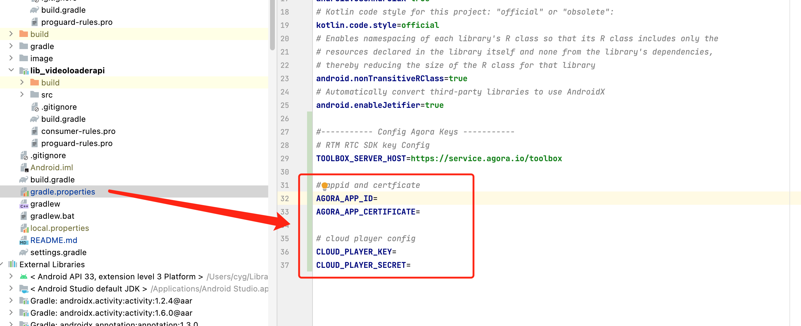

# VideoLoaderAPI

*Read this in other languages: [English](README.md)*

VideoLoaderAPI 即秒开秒切场景化 API, 该模块旨在帮助视频直播开发者更快集成声网秒切、秒开相关能力的最佳实践

### 一、快速开始

这个部分主要介绍如何快速跑通 VideoLoaderAPI Demo

#### 1. 环境准备

- 最低兼容 Android 5.0（SDK API Level 21）
- Android Studio 3.5及以上版本
- Android 5.0 及以上的手机设备

#### 2. 运行示例

## 2. 运行示例

- 2.1 进入声网控制台获取 APP ID 和 APP 证书 [控制台入口](https://console.shengwang.cn/overview)

  - 点击创建项目

    

  - 选择项目基础配置, 鉴权机制需要选择**安全模式**

    

  - 拿到项目 APP ID 与 APP 证书

    

  - 秒切机器人服务配置（RTE-CloudPlayer）
      ```json
      注: 请联系声网技术支持为您的 APPID 开通 rte-cloudplayer 权限, 开通权限后才能启动默认的机器人房间推流
      ```
    
    
    

- 2.2 在项目的 [**gradle.properties**](gradle.properties) 里填写需要的声网 APP ID 和 APP 证书、RESTFUL KEY 和 SECRET
    

  ```texag-0-1gpap96h0ag-1-1gpap96h0ag-0-1gpap96h0ag-1-1gpap96h0ag-0-1gpap96h0ag-1-1gpap96h0ag-0-1gpap96h0ag-1-1gpap96h0ag-0-1gpap96h0ag-1-1gpap96h0
  AGORA_APP_ID：声网 APP ID
  AGORA_APP_CERTIFICATE：声网 APP 证书
  CLOUD_PLAYER_KEY：声网RESTful API key
  CLOUD_PLAYER_SECRET：声网RESTful API secret

- 2.3 用 Android Studio 运行项目即可开始您的体验

#### 3. 项目介绍

- <mark>1. 概述</mark>
> VideoLoaderAPI 即秒开秒切场景化api, 该模块旨在帮助视频直播开发者更快集成声网秒切、秒开相关能力的最佳实践
>
- <mark>2. 功能介绍</mark>
> VideoLoaderAPI Demo 目前已涵盖以下功能
> - 选择预加载模式和视频出图模式
>
>   相关代码请参考：[MainActivity](app/src/main/java/io/agora/videoloaderapi/ui/MainActivity.kt)
>
> - 秒开
>
>   相关代码请参考：[RoomListActivity](app/src/main/java/io/agora/videoloaderapi/ui/RoomListActivity.kt)
>
> - 秒切
>
>   - ViewPager
>   
>     相关代码请参考：[LiveViewPagerActivity](app/src/main/java/io/agora/videoloaderapi/ui/LiveViewPagerActivity.kt) 中的 OnPageChangeCallback 的实现
>   
>   - RecycleView
>   
>     相关代码请参考：[LiveRecycleViewActivity](app/src/main/java/io/agora/videoloaderapi/ui/LiveRecycleViewActivity.kt) 中的 OnScrollListener 的实现


### 二、快速集成

请参考官网文档 [集成 VideoLoaderAPI](https://doc.shengwang.cn/doc/showroom/android/advanced-features/video-loader/integrate)

